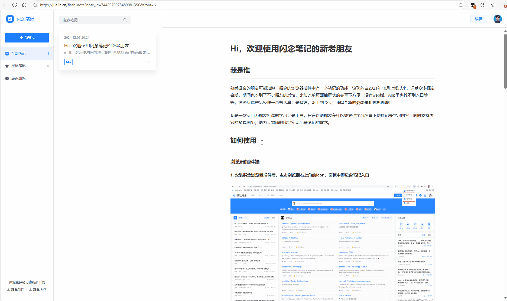

# flash-notes-script

闪念笔记-油猴插件版本，灵感来源：[掘金闪念笔记](https://juejin.cn/flash-note)

## 功能亮点

1. **跨页面笔记同步**：使用油猴的GM_setValue/GM_getValue API实现数据持久化
2. **智能分类**：按域名自动分类笔记，方便查找
3. **多种记录方式**：
   - 选中文本快速记录
   - 手动输入笔记内容
4. **强大的搜索**：支持全文搜索，快速定位笔记
5. **数据导出**：一键导出为Markdown格式，方便整理
6. **快捷键支持**：Ctrl+Shift+N快速打开/关闭笔记面板
   
   

## 使用教程

1. 安装 `Tampermonkey` 插件
2. 创建新脚本，粘贴完整代码
3. 保存后刷新页面即可使用
4. 使用方式：
   - 选中文本，点击出现的"添加闪念"按钮
   - 或使用快捷键打开面板手动添加
   - 右键Tampermonkey图标选择"显示闪念笔记"查看所有记录
     
     

